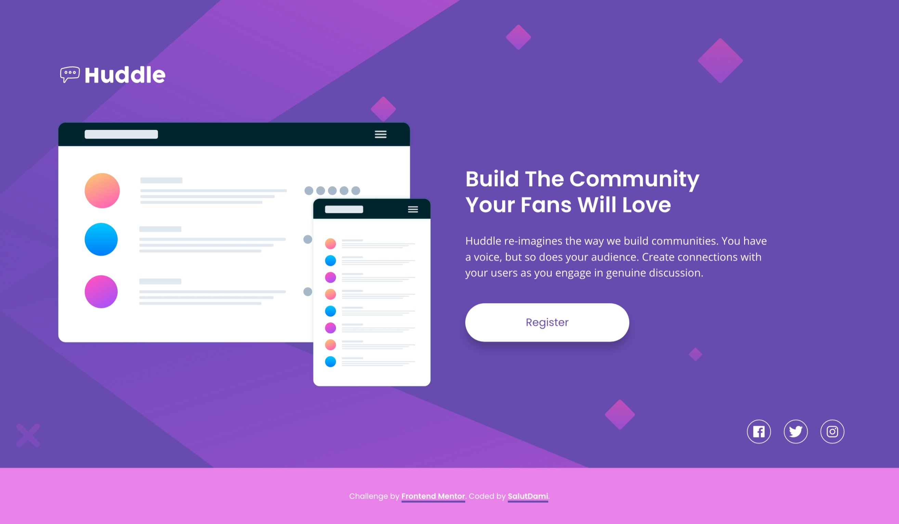

## Table of contents

- [Overview](#overview)
  - [The challenge](#the-challenge)
  - [Screenshot](#screenshot)
  - [Links](#links)
- [My process](#my-process)
  - [Built with](#built-with)
- [Author](#author)
- [Acknowledgments](#acknowledgments)

## Overview

### The challenge

Users will be able to:

- View the optimal layout for the page depending on their device's screen size
- See hover states for all interactive elements on the page

### Screenshot

_A desktop view or the project_

_A mobile view or the project_

### Links

- Solution URL: [Add solution URL here](https://github.com/salutDami/Huddle-landing-page)
- Live Site URL: [Add live site URL here](https://salutdami.github.io/Huddle-landing-page/)

## My process

### Built with

- Semantic HTML5 markup
- CSS custom properties
- Flexbox
- CSS Grid
- Mobile-first workflow

## Author

- Twitter - [@\_salutDami](https://www.twitter.com/_salutDami)
- Linkedin- [Ikuomola Stephen](https://www.linkedin.com/in/ikuomola-stephen/)
- Frontend Mentor - [@salutDami](https://www.frontendmentor.io/profile/salutDami)
